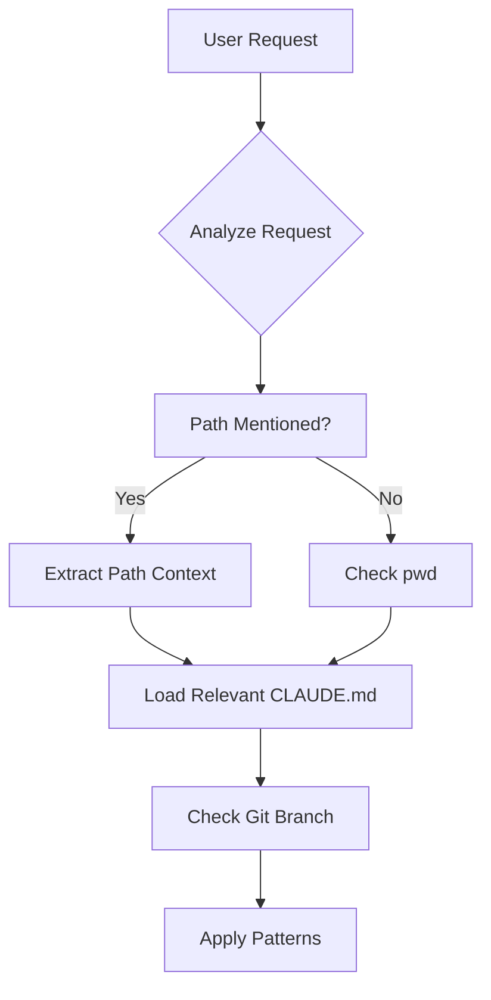

# PRD: Dynamic Context Orchestration System

## 🆕 NEW THINKING: Integration with construct-init Infrastructure

**CRITICAL UPDATE**: This dynamic context orchestration system now builds on the enhanced `construct-init` orchestrator that ensures every project has complete CONSTRUCT infrastructure.

**Key Integration Points**:
- **Infrastructure Reliability**: Dynamic context switching now guaranteed to work because `construct-init` ensures every project has CONSTRUCT/, AI/, .construct/
- **Pattern Context Loading**: Can reliably load .construct/patterns.yaml because construct-init ensures it exists and is valid
- **Script Execution**: Can reliably execute CONSTRUCT scripts because construct-init validates they work
- **Consistent Interface**: Every project has same CONSTRUCT interface, making dynamic switching predictable

**Enhanced Capabilities**:
- Context switching works immediately after project import (infrastructure guaranteed)
- Pattern loading is reliable (construct-init validates pattern configurations)
- Script execution is consistent (construct-init tests all scripts work)
- No "broken project" scenarios (construct-init ensures complete setup)

**This significantly enhances the dynamic context system** by providing a reliable foundation of complete infrastructure in every project.

## Overview

This PRD defines how Claude Code dynamically orchestrates context switching across multiple projects and repositories within a CONSTRUCT workspace. It leverages Claude Code's ability to execute commands to provide intelligent, real-time context awareness, building on the infrastructure guaranteed by construct-init.

## 🎯 User Feedback & Real-Time Awareness (2025-07-21)

**Real-Time CLAUDE.md Awareness**: Claude immediately knows when CLAUDE.md files change:
- **File change detection** monitors CLAUDE.md updates
- **Immediate pattern awareness** - "I see you just added SwiftUI patterns"
- **Dynamic context refresh** without restart required
- **Context continuity** throughout development sessions

**Focused Context Switching**: Each project context remains **project-centric** during switches:
- **Project knowledge prominent** in each context
- **Relevant patterns only** based on current project
- **No pattern pollution** between projects
- **Clean context boundaries** with intelligent coordination

**Multi-Project Intelligence**: Claude SDK coordinates context switching while maintaining focused, project-specific experiences.

## Problem Statement

Current limitations in our system:
1. CLAUDE.md appears to load once at conversation start
2. Multiple projects/repos need different contexts
3. Developers work across multiple contexts in one session
4. Static context doesn't reflect current branch/location

However, Claude Code CAN:
- Execute commands (`pwd`, `git branch`, `cat`)
- Read any file dynamically
- Check system state in real-time

## Solution: Dynamic Context Orchestration

### Core Innovation

Instead of relying on static CLAUDE.md loading, we use Claude Code's command execution + Claude SDK:
1. Detect current working context via `pwd`
2. Load appropriate CLAUDE.md via `cat`
3. Check git branch via `git branch --show-current`
4. Use Claude SDK to intelligently apply correct patterns based on location and state

## Technical Architecture

### Context Detection Flow



### Dynamic Context Commands

```bash
# Core context detection
pwd                                    # Current directory
git branch --show-current              # Current branch
cat .construct/patterns.yaml           # Active patterns

# Context loading
cat CLAUDE.md                          # Local context
cat ../../../CONSTRUCT-LAB/CLAUDE.md   # CONSTRUCT context
cat Projects/MyApp/ios/CLAUDE.md       # Project context

# State verification
ls -la .git                           # Verify repo root
git remote -v                         # Check which repo
```

## Implementation Strategy

### 1. Root Context Orchestrator

Create a root CLAUDE.md that teaches Claude how to orchestrate:

```markdown
# CONSTRUCT/CLAUDE.md

## Dynamic Context Orchestration

I can dynamically load and switch contexts based on your work:

### Context Detection Protocol

1. When you mention a file path → I detect which project
2. When you say "create pattern" → I know to use CONSTRUCT-LAB
3. When context is unclear → I check pwd and load local context

### Available Commands

- `check context` - I'll detect and load current context
- `load ios context` - Explicitly load iOS project context  
- `refresh context` - Reload current CLAUDE.md
```

### 2. Context Detection Patterns

```markdown
## Path-Based Context Detection

| Path Pattern | Action | Context to Load |
|-------------|--------|-----------------|
| `CONSTRUCT-LAB/**` | `cat CONSTRUCT-LAB/CLAUDE.md` | CONSTRUCT development |
| `Projects/*/ios/**` | `cat Projects/*/ios/CLAUDE.md` | iOS development |
| `Projects/*/backend/**` | `cat Projects/*/backend/CLAUDE.md` | Backend development |

## Keyword Detection

| Keywords | Likely Context | Verification |
|----------|----------------|--------------|
| "pattern", "plugin", "LAB" | CONSTRUCT development | Check if in CONSTRUCT-LAB |
| "Swift", "iOS", "View" | iOS development | Look for .swift files |
| "API", "endpoint", "C#" | Backend development | Look for .cs files |
```

### 3. Context Loading Functions

Claude can use these command patterns:

```bash
# Function: Load context for current directory
current_dir=$(pwd)
if [ -f "./CLAUDE.md" ]; then
    echo "Loading local context..."
    cat ./CLAUDE.md
else
    echo "No local CLAUDE.md found"
fi

# Function: Find and load nearest CLAUDE.md
while [ "$PWD" != "/" ]; do
    if [ -f "CLAUDE.md" ]; then
        cat CLAUDE.md
        break
    fi
    cd ..
done

# Function: Load multiple contexts
cat CONSTRUCT-LAB/CLAUDE.md > /tmp/combined-context.md
echo "\n---\n" >> /tmp/combined-context.md
cat Projects/MyApp/ios/CLAUDE.md >> /tmp/combined-context.md
cat /tmp/combined-context.md
```

### 4. Branch-Aware Context

```bash
# Get current branch context
branch=$(git branch --show-current)
echo "Current branch: $branch"

# Check if branch-specific patterns exist
if [ -f ".construct/patterns-$branch.yaml" ]; then
    cat ".construct/patterns-$branch.yaml"
else
    cat ".construct/patterns.yaml"
fi
```

## User Experience

### Scenario 1: Creating a Pattern

```
User: "Create a new pattern for coordinator navigation"

Claude executes:
- pwd → /Users/.../CONSTRUCT/Projects/MyApp/ios
- Detects: Not in CONSTRUCT-LAB
- cat ../../../CONSTRUCT-LAB/CLAUDE.md
- Now has CONSTRUCT development context
- Creates pattern in correct location
```

### Scenario 2: Working Across Projects

```
User: "Update the User model in iOS and backend"

Claude executes:
- cat Projects/MyApp/ios/CLAUDE.md
- cat Projects/MyApp/backend/CLAUDE.md  
- Loads both contexts
- Understands both Swift and C# patterns
- Coordinates changes across both
```

### Scenario 3: Branch-Specific Work

```
User: "What patterns apply here?"

Claude executes:
- pwd → Shows current location
- git branch --show-current → feature/new-auth
- cat .construct/patterns.yaml
- cat CLAUDE.md
- Reports: "On feature/new-auth with Swift, MVVM, auth patterns"
```

## Integration with Existing Systems

### Pattern System Integration
- Dynamically loads pattern definitions from CLAUDE.md files
- Can check which patterns are available in LAB vs CORE
- Applies patterns based on current context

### Workspace Integration  
- Understands Projects/ structure
- Can navigate between project components
- Loads appropriate context for each repository

### Context Engineering Integration
- Uses existing auto-update scripts
- Can run `update-context.sh` to refresh
- Leverages violation detection scripts

## Commands Reference

### Context Management Commands

```bash
# Check current context
pwd && git branch --show-current

# Load specific context
cat Projects/MyApp/ios/CLAUDE.md

# Refresh current context
./CONSTRUCT/scripts/update-context.sh && cat CLAUDE.md

# Load multiple contexts
cat CONSTRUCT-LAB/CLAUDE.md && echo "---" && cat Projects/MyApp/ios/CLAUDE.md

# Find all CLAUDE.md files
find . -name "CLAUDE.md" -type f

# Check available patterns
ls CONSTRUCT-CORE/patterns/plugins/
ls CONSTRUCT-LAB/patterns/
```

### Smart Context Detection

```bash
# Detect project type
if [ -f "Package.swift" ]; then
    echo "Swift project detected"
elif [ -f "*.csproj" ]; then  
    echo "C# project detected"
fi

# Load context based on file type
case "$1" in
    *.swift) cat "$(find . -name CLAUDE.md -path "*/ios/*" | head -1)" ;;
    *.cs) cat "$(find . -name CLAUDE.md -path "*/backend/*" | head -1)" ;;
esac
```

## Benefits

1. **True Multi-Context Support** - Work across projects in one session
2. **Dynamic Updates** - Always current branch/location aware
3. **Intelligent Switching** - Automatic context detection
4. **No Manual Setup** - Commands handle context loading
5. **Preserves Conversation** - No need for new sessions

## Success Metrics

1. **Context Accuracy**: 95% correct context detection
2. **Switch Speed**: Context loads in <2 seconds
3. **User Satisfaction**: No manual context management needed
4. **Cross-Project Work**: Seamless coordination

## Future Enhancements

1. **Context Caching** - Store loaded contexts for faster switching
2. **Predictive Loading** - Pre-load likely contexts
3. **Context Merging** - Intelligently combine multiple contexts
4. **Visual Indicators** - Show current context in responses

## Risks & Mitigations

### Risk: Command Execution Overhead
**Mitigation**: Cache frequently used contexts in memory

### Risk: Large CLAUDE.md Files
**Mitigation**: Load only relevant sections based on task

### Risk: Context Confusion
**Mitigation**: Clear indicators of which context is active

## Dependencies

- Pattern System (unified-pattern-system-plan-v32.md)
- Workspace Structure (workspace-import-prd-v11.md)  
- Context Engineering (context-engineering-integration-prd-v01.md)
- Claude Code command execution capability

---

**Status**: Ready for Implementation
**Priority**: Critical (enables true multi-project development)
**Complexity**: Medium (leverages existing capabilities)
**Innovation**: Dynamic context loading via command execution