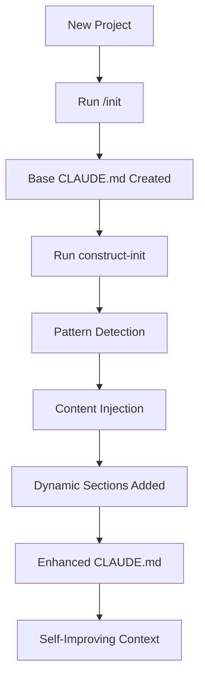

# The Two-Stage Initialization System: /init and construct-init

## Overview

CONSTRUCT implements a sophisticated two-stage initialization system that works in harmony with Claude Code's built-in `/init` command. This design represents a fundamental insight: rather than replacing Claude Code's features, CONSTRUCT enhances and extends them through intelligent layering.

## The Two Stages

### Stage 1: /init (Claude Code Native)
The `/init` command is Claude Code's built-in feature that creates a foundational CLAUDE.md file. When you run `/init` in a project:

1. Claude analyzes the codebase structure
2. Identifies key commands (build, test, lint)
3. Understands the architecture and patterns
4. Creates a static CLAUDE.md with this knowledge

**Example output:**
- Project overview and purpose
- Essential commands for development
- Architecture explanation
- Code examples and patterns

### Stage 2: construct-init (CONSTRUCT Enhancement)
The `construct-init` command takes the foundation created by `/init` and transforms it into a dynamic, pattern-aware, self-improving context system:

1. **Preserves the base content** from /init
2. **Injects pattern-specific content** based on your active patterns
3. **Adds auto-updating sections** that refresh with each context update
4. **Enables the pattern plugin system** for continuous improvement

## How They Work Together



### The Complementary Design

The genius of this approach is that it respects and enhances Claude Code's native capabilities:

1. **Non-Destructive Enhancement**: construct-init doesn't overwrite the valuable analysis from /init
2. **Additive Architecture**: Each stage adds value without removing existing functionality
3. **Separation of Concerns**: 
   - /init handles codebase analysis and static documentation
   - construct-init handles dynamic patterns and continuous improvement

## Key Insights

### 1. Working WITH Claude Code, Not Against It
CONSTRUCT recognizes that Claude Code's /init provides valuable codebase analysis that would be redundant to replicate. Instead of reimplementing this functionality, CONSTRUCT builds upon it.

### 2. Static Foundation, Dynamic Enhancement
- **Static** (from /init): Project structure, commands, architecture
- **Dynamic** (from construct-init): Active patterns, current violations, recent changes, auto-updating context

### 3. Pattern-Aware Evolution
The two-stage system enables:
- Initial understanding (via /init)
- Continuous learning (via construct-init and patterns)
- Context that improves with every commit

## Implementation Example

### Step 1: Initial Setup
```bash
# In a new project
/init  # Creates base CLAUDE.md
```

### Step 2: CONSTRUCT Enhancement
```bash
# Enhance with CONSTRUCT patterns
./construct-init

# Or if you have specific patterns in mind
./construct-init --patterns languages/python,tooling/git-workflow
```

### Step 3: Continuous Updates
```bash
# Before each Claude session
construct-update  # Refreshes dynamic sections
```

## What Makes This Special

### For Claude Code Users
- Your familiar /init command still works exactly as expected
- You get additional power through CONSTRUCT's enhancements
- No need to learn a completely new system

### For CONSTRUCT Users
- Leverages Claude Code's excellent codebase analysis
- Adds the pattern system on top for continuous improvement
- Creates a truly intelligent development environment

### The Philosophy
This two-stage approach embodies CONSTRUCT's core philosophy:
- **Enhance, don't replace**
- **Build on existing tools' strengths**
- **Make AI assistance progressively smarter**

## Technical Architecture

### Base CLAUDE.md Structure (from /init)
```markdown
# CLAUDE.md

Project overview...
Commands...
Architecture...
```

### Enhanced Structure (after construct-init)
```markdown
# CLAUDE.md

Project overview...  <!-- Preserved from /init -->

<!-- START:PATTERN-CONTENT -->
[Pattern-specific guidelines, examples, commands]
<!-- END:PATTERN-CONTENT -->

Commands...  <!-- Enhanced with pattern additions -->

<!-- START:DYNAMIC-SECTIONS -->
[Auto-updating content]
<!-- END:DYNAMIC-SECTIONS -->
```

## Benefits of the Two-Stage Approach

1. **Best of Both Worlds**: Claude's analysis + CONSTRUCT's patterns
2. **Progressive Enhancement**: Start simple, add complexity as needed
3. **Backward Compatible**: Existing /init users can adopt CONSTRUCT gradually
4. **Forward Thinking**: New patterns can be added without changing the base system

## Conclusion

The /init and construct-init partnership represents thoughtful system design that enhances rather than replaces existing tools. By working together, they create a development environment where AI assistance continuously improves through structured pattern capture and dynamic context management.

This is not just about making Claude Code better - it's about creating a new paradigm where development environments learn and improve alongside the developers using them.